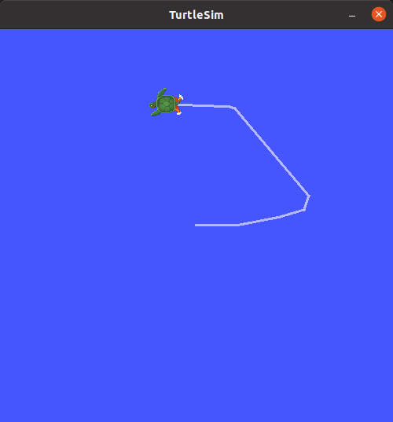

# ROS2 Topics Communication Example
In this example, we use ROS2 built-in package, `turtlesim`,  to show how ROS2 communicate via **topics** at local machine.



### Terminal 1
Run turtlesim node.
```
Laptop $ source docker_run.sh

Docker $ source ros2_environment.sh
Docker $ ros2 run turtlesim turtlesim_node
```

### Terminal 2
Run turtlesim teleop control.
```
Laptop $ source docker_join.sh

Docker $ source ros2_environment.sh
Docker $ ros2 run turtlesim turtle_teleop_key
```