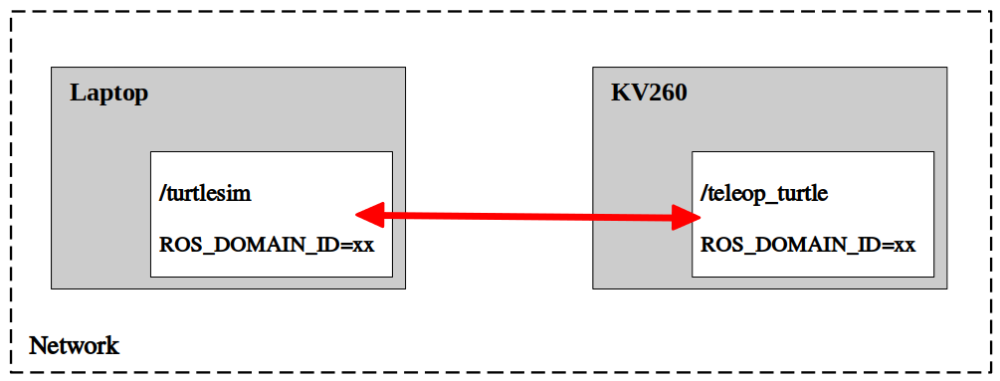

# ROS2 Topics Multi-Machine Communication Example
In this example, we show how to use **ROS_DOMAIN_ID** to communicate between two different ROS2 machines that are at same network domain. Here we use laptop and KV260 for example. 

## ROS diagram



## ROS_DOMAIN_ID
All ROS2 nodes use domain ID 0 by default. To avoid interference between different groups of computers running ROS2 on the same network, a different domain ID should be set for each group.
|     Type      |  Range  |
| ------------- | ------- |
| Short version | 0 ~ 101 |
| Long version  | 0 ~ 232 |

------

## Laptop

### Terminal 1
Set ROS_DOMAIN_ID and run turtlesim node.
```
Laptop $ source pc_run.sh

Docker $ source ros2_environment.sh
Docker $ export ROS_DOMAIN_ID=<your_domain_id>
Docker $ ros2 run turtlesim turtlesim_node
```

## KV260

### Terminal 1
Set ROS_DOMAIN_ID and run turtlesim teleop control.
```
Laptop $ source kv260_run.sh

Docker $ source ros2_environment.sh
Docker $ export ROS_DOMAIN_ID=<your_domain_id>
Docker $ ros2 run turtlesim turtle_teleop_key
```

-----

## Question 1: 
What will happen if you don't set a specific ROS_DOMAIN_ID?

## Question 2:
What will happen if the ROS_DOMAIN_ID of two machines are not consistent?