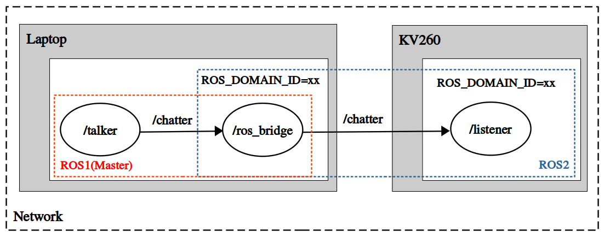
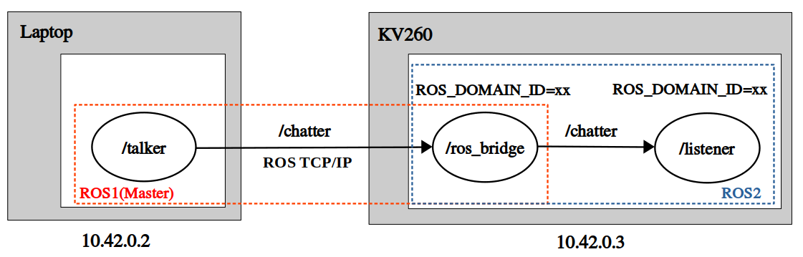

# ros1_bridge Multi-Machine Example
In this example, we use `ros1_bridge` package and **ROS_DOMAIN_ID** to bridge messages between ROS1 and ROS2 at different machines. Here we use laptop and KV260 for example.

## Method 1



## Laptop (ROS1 + ROS2)

### Terminal 1
Launch ROS1 master.
```
Laptop $ source pc_run.sh

Docker $ source ros1_environment.sh
Docker $ roscore
```

### Terminal 2
Run ROS1 publisher.
```
Laptop $ source pc_join.sh

Docker $ source ros1_environment.sh
Docker $ rosrun rospy_tutorials talker
```

### Terminal 3
Set ROS_DOMAIN_ID and run ros1_bridge.
```
Laptop $ source pc_join.sh

Docker $ source ros1_environment.sh
Docker $ source ros2_environment.sh
Docker $ export ROS_DOMAIN_ID=<your_domain_id>
Docker $ ros2 run ros1_bridge dynamic_bridge
```

## KV260 (Pure ROS2)

### Terminal 1
Set ROS_DOMAIN_ID and run ROS2 subscriber.
```
KV260 $ source kv260_run.sh

Docker $ source ros2_environment.sh
Docker $ export ROS_DOMAIN_ID=<your_domain_id>
Docker $ ros2 run demo_nodes_py listener
```

## Method 2 (Advanced)



## Laptop (Pure ROS1)

### Terminal 1
Set master IP and launch ROS1 master.
```
Laptop $ source pc_run.sh

Docker $ source ros1_environment.sh
Docker $ export ROS_MASTER_URI=http://10.42.0.2:11311
Docker $ export ROS_IP=10.42.0.2
Docker $ roscore
```

### Terminal 2
Set master IP and run ROS1 publisher.
```
Laptop $ source pc_join.sh

Docker $ source ros1_environment.sh
Docker $ export ROS_MASTER_URI=http://10.42.0.2:11311
Docker $ export ROS_IP=10.42.0.2
Docker $ rosrun rospy_tutorials talker
```

## KV260 (ROS1 + ROS2)

### Terminal 1
Set master IP, ROS_DOMAIN_ID, and run ros1_bridge.
```
KV260 $ source kv260_run.sh

Docker $ source ros1_environment.sh
Docker $ source ros2_environment.sh

Docker $ export ROS_MASTER_URI=http://10.42.0.2:11311
Docker $ export ROS_IP=10.42.0.3
Docker $ export ROS_DOMAIN_ID=<your_domain_id>

Docker $ ros2 run ros1_bridge dynamic_bridge
```

### Terminal 2
Set ROS_DOMAIN_ID and run ROS2 subscriber.
```
KV260 $ source kv260_join.sh

Docker $ source ros2_environment.sh
Docker $ export ROS_DOMAIN_ID=<your_domain_id>
Docker $ ros2 run demo_nodes_py listener
```